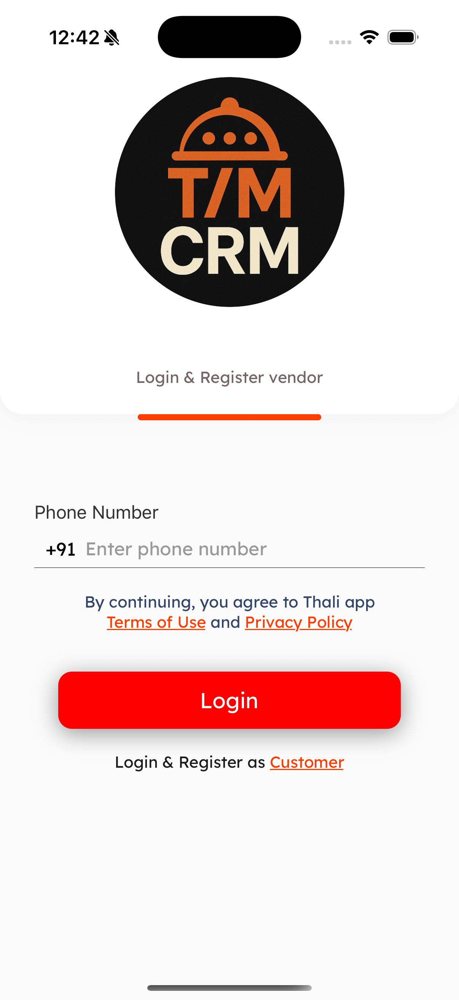
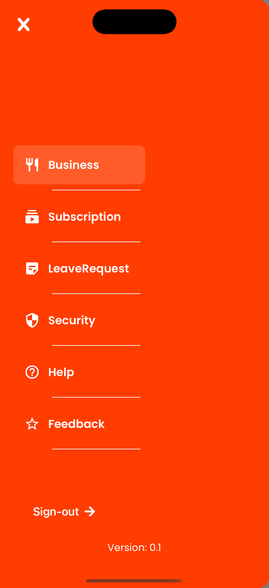
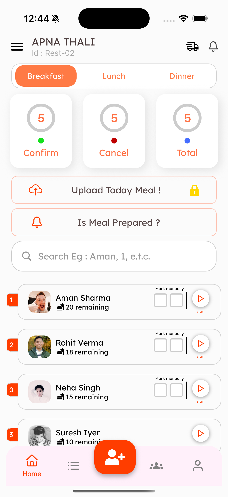

# NanoStack Assignment App

A responsive mobile app built with React Native for the NanoStack assignment. It includes a full authentication flow using Redux and conditionally rendered navigation stacks based on auth state.

---

## ✅ Final Features

### 🔒 Authentication

- Redux Toolkit setup with `login` and `logout` reducers
- Global `isAuthenticated` state management
- Seamless navigator switching using `RootNavigator`

### 🧭 Navigation

- Conditional root navigation (`AuthNavigation` vs `LocalNavigation`)
- Custom drawer with icons, close button, version label
- Home screen with:
  - Meal selector
  - Attendance cards
  - Stats widgets
  - Search bar

### 🧱 Reusable Components

- `ButtonWithIcon` (prefix/suffix JSX icons)
- `CustomCheckbox`
- `PlayPauseBtn` with logic
- `SegmentController`

### 📱 Responsive UI

- Layouts use `Dimensions.get("window")` for scaling
- Fully optimized for:
  - iPhone 16 Pro (2622×1206 @ 460ppi)
  - Android emulator (1024×2400 @ 420dpi)
- ⚠️ May not render correctly on other device sizes

---

## 🛠 Tech Stack

- **React Native**
- **Redux Toolkit**
- **React Navigation**
- **Expo (EAS Build)**
- **TypeScript & VS Code**
- **Custom Font Integration**

---

## 📸 Screenshots

| Login Screen                                  | Drawer                                         | Home Screen                                        |
| --------------------------------------------- | ---------------------------------------------- | -------------------------------------------------- |
|  |  |  |

---

## 🚀 Setup

Install dependencies:

```bash
npm install
```

Run the project:

```bash
npx expo start
```

---

## 🎬 Demo


- Video demo: [Watch the demo video](https://drive.google.com/file/d/1Hh1CGyks7d-7ikMq5W-W7o1igLxL7mMf/view?usp=drive_link)

- Download APK: [Get the APK](https://drive.google.com/file/d/16kzIZB9vu7GbmWvfUVMiAoUVwULEvdC1/view?usp=drive_link)

---

---

## 📌 Notes

- This NanoStack Assignment App was tested and developed on:
  - Medium Android Emulator: resolution **1024×2400**, density **420dpi**
  - iPhone 16 Pro: resolution **2622×1206**, density **460ppi**
- In React Native, the scale factor is 3 on iPhone 16 Pro, meaning **1 point = 3 physical pixels**
- ⚠️ Layout and design may break on devices with significantly different screen specs
