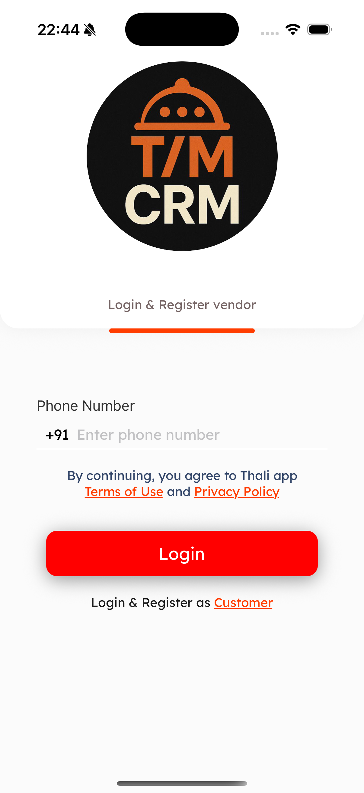
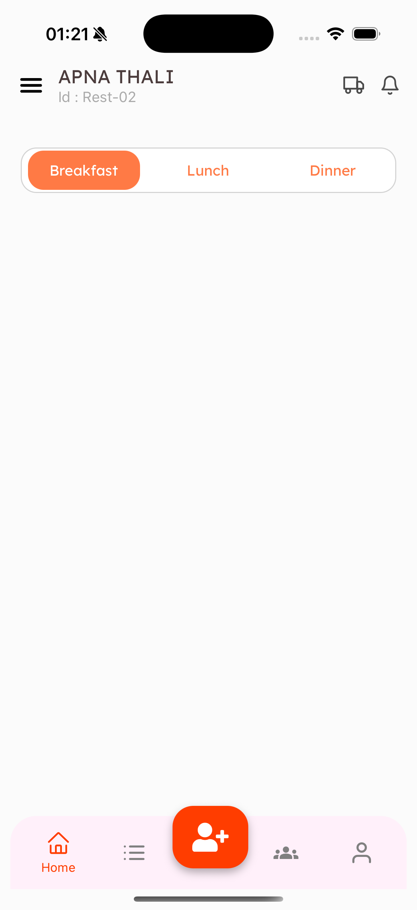
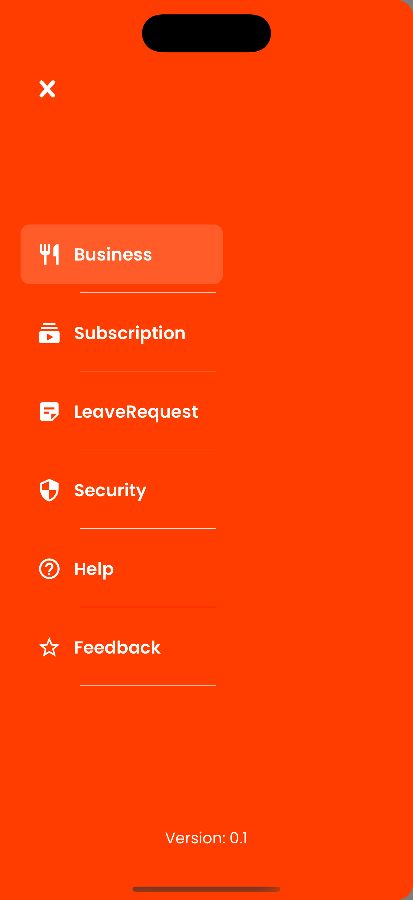

# NanoStack Assignment

This project contains the implementation of the login flow UI for the NanoStack assignment using React Native and Expo.

# 📸 Demo

### LOGIN SCREEN - 1



### Custom BottomTabs - 2



### Basic Drawer - 3


### Custom Drawer - 4



## ✅ Features

- Fully designed login screen using custom fonts (`LexendDeca`, `Lato`)
- Centralized color system from `src/constants/colors.ts`
- Responsive and modern UI built with reusable components
- Organized file structure with screens, navigation, and components
- Nested navigation using Drawer and Bottom Tabs
- CustomBottomTab component with floating AddUser button and active tab labeling
- CustomDrawerHeader for improved top bar layout with icons and spacing
- SegmentController component for Breakfast/Lunch/Dinner toggle with parent state control
- SwitchToCustomerNotice and TermsNotice extracted for clean, reusable UI
- Fully customized full-width drawer with animated close button and screen highlighting
- Reusable ButtonWithIcon component supporting prefix and suffix icons (passed as full JSX)
- Fake customer card data defined in `src/data/data.ts` including attendance status and meal info
- Dynamic icon rendering for drawer items using screen name → icon mapping

## 🚀 Setup

Install dependencies:

```bash
npm install
```

Run the project:

```bash
npx expo start
```
